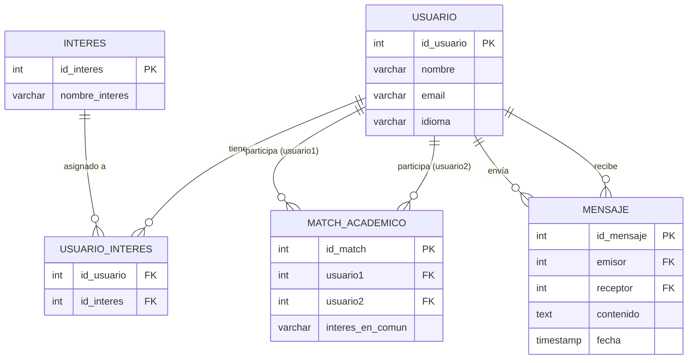

# DER — UniMatch (PostgreSQL)

Diagrama Entidad-Relación del modelo relacional de UniMatch.

## Descripción de entidades

| Entidad | Descripción |
|---------|-------------|
| `usuario` | Persona registrada en UniMatch |
| `interes` | Tema o área académica de interés |
| `usuario_interes` | Relación muchos-a-muchos entre usuario e interés |
| `match_academico` | Pareja de usuarios con al menos un interés en común |
| `mensaje` | Mensaje enviado entre dos usuarios |
