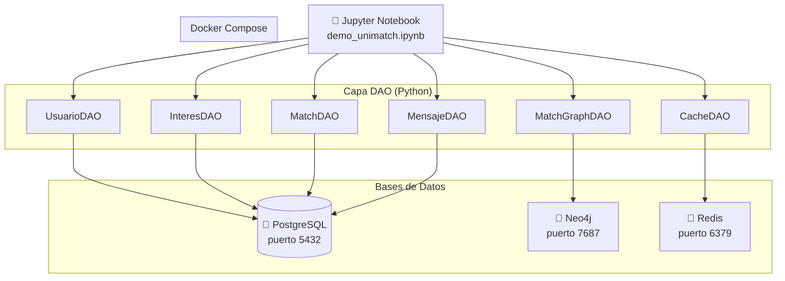

[arquitectura_general.md](https://github.com/user-attachments/files/28284119/arquitectura_general.md)
# Arquitectura General — UniMatch

## Descripción de capas

### Jupyter Notebook
Punto de entrada de la demo. Importa los DAOs y ejecuta operaciones sobre las tres bases de datos.

### Capa DAO
Abstrae el acceso a cada base de datos. Cada DAO es independiente y maneja su propia conexión.

| DAO | Base | Responsabilidad |
|-----|------|-----------------|
| `UsuarioDAO` | PostgreSQL | CRUD de usuarios |
| `InteresDAO` | PostgreSQL | CRUD de intereses y relación usuario↔interés |
| `MatchDAO` | PostgreSQL | Matches registrados y cálculo de posibles matches |
| `MensajeDAO` | PostgreSQL | Envío y lectura de mensajes entre usuarios |
| `MatchGraphDAO` | Neo4j | Recomendaciones de matches mediante grafo |
| `CacheDAO` | Redis | Usuarios activos y matches recientes en caché |

### Docker Compose
Levanta los tres motores de bases de datos en contenedores listos para usar.
