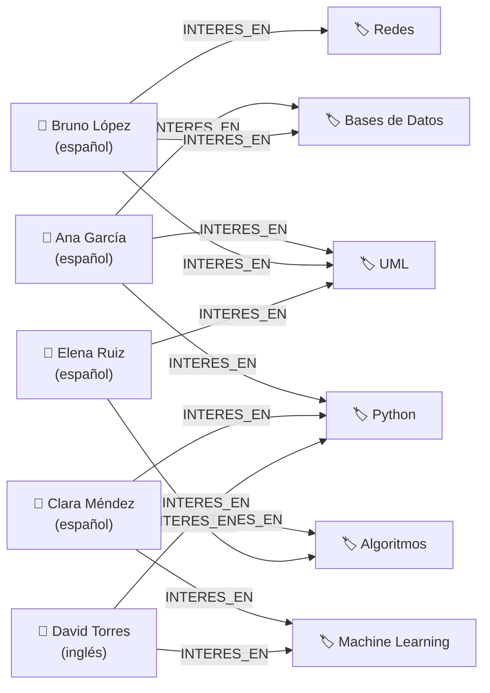

# Grafo Conceptual — UniMatch (Neo4j)

Representación del grafo de usuarios e intereses en Neo4j.



## Matches que detecta el grafo

Cuando dos usuarios apuntan al mismo nodo `Interes`, Neo4j los detecta como posible match:

| Usuario 1 | Usuario 2 | Intereses en común |
|-----------|-----------|-------------------|
| Ana García | Bruno López | UML, Bases de Datos |
| Ana García | Clara Méndez | Python |
| Ana García | Elena Ruiz | UML |
| Clara Méndez | David Torres | Python, Machine Learning |
| Bruno López | Elena Ruiz | UML |

## Consulta Cypher equivalente

```cypher
MATCH (u1:Usuario)-[:INTERES_EN]->(i:Interes)<-[:INTERES_EN]-(u2:Usuario)
WHERE u1.nombre < u2.nombre
RETURN u1.nombre, u2.nombre, collect(i.nombre) AS intereses_comunes
```
